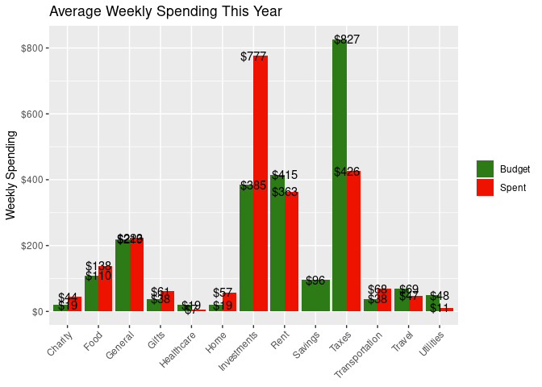
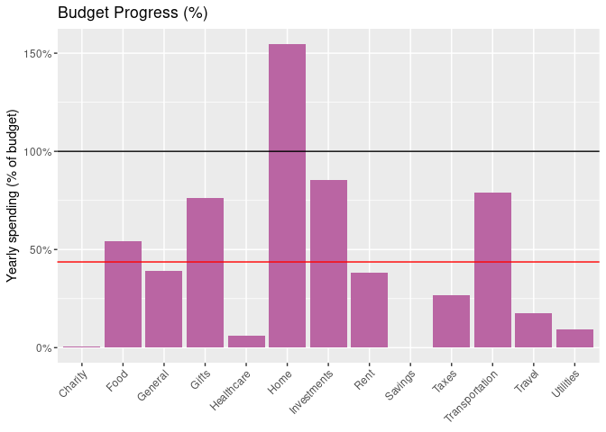
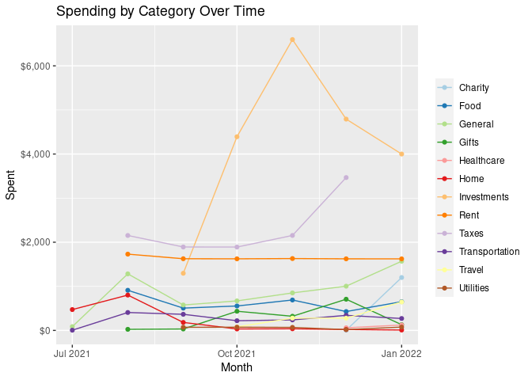

Callan’s Budget
================
Callan Hoskins
<<<<<<< Updated upstream
2022-01-04
=======
2022-01-07

    ## # A tibble: 0 × 7
    ## # … with 7 variables: post_date <date>, debit <dbl>, desc <chr>,
    ## #   category <chr>, weekday <ord>, week <date>, month <ord>
>>>>>>> Stashed changes

<!-- -->

Your yearly deficit so far is $2324.678544, or 0.0444158%.

<!-- -->

<!-- -->
<!-- -->
